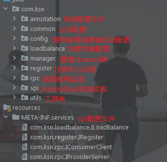

# 借鉴dubbo 用netty手写rpc框架

#### 介绍
使用netty手写rpc框架

#### 软件架构

#### 安装教程

下载maven导入依赖
开启注册中心 

在provider工程中要加`@CustomService`到要注册的类上，相当于 dubbo的`@Service`注解。在consumer工程的启动类上加上`@EnableCustomDubbo`注解，相当于dubbo的`@EnableDubbo`注解。然后在consumer工程中要注入的地方加上`@CustomService`注解，这个相当于dubbo的`@Service`注解。然后就可以正常调用了。

#### 实现功能
 * dubbo的spi机制
 * 负载均衡
 * 注册中心
 * netty作为底层调用
 * 实现autowired注解功能
 * 自定义注解

#### 执行流程

#### 欢迎交流
有什么问题还请指出 
email: kingofgz@163.com
qq: 1459608577
